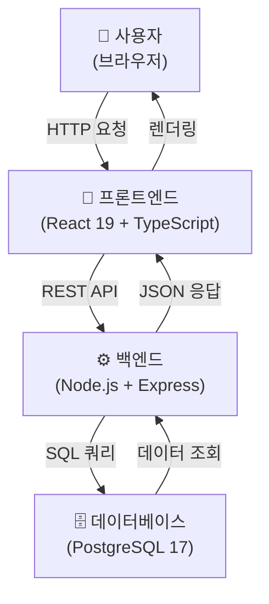
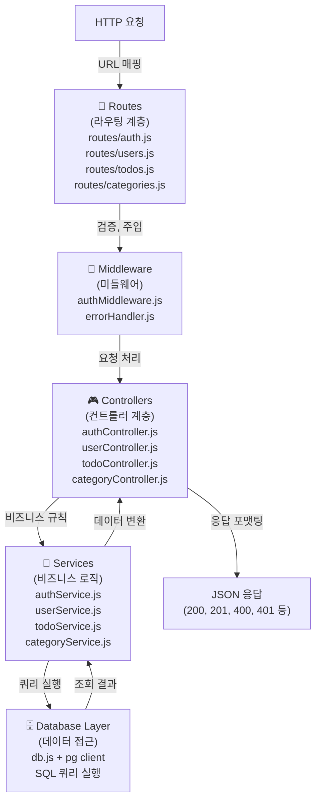
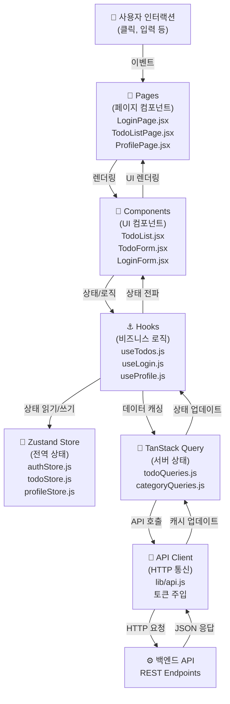
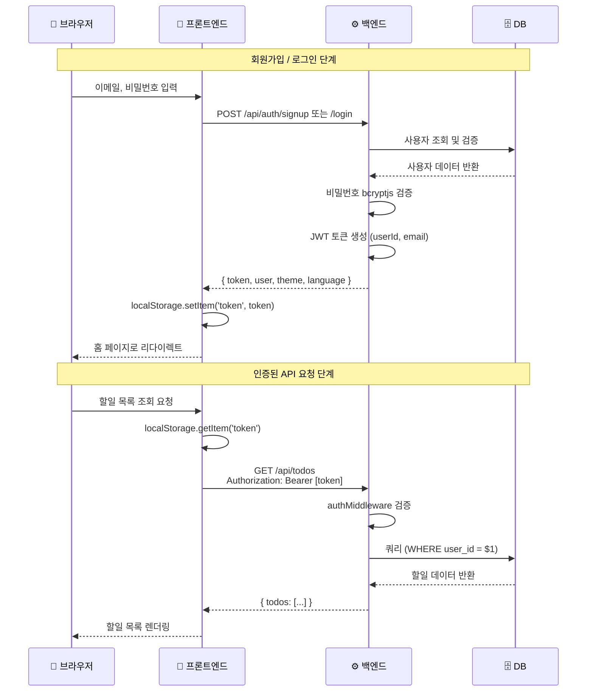
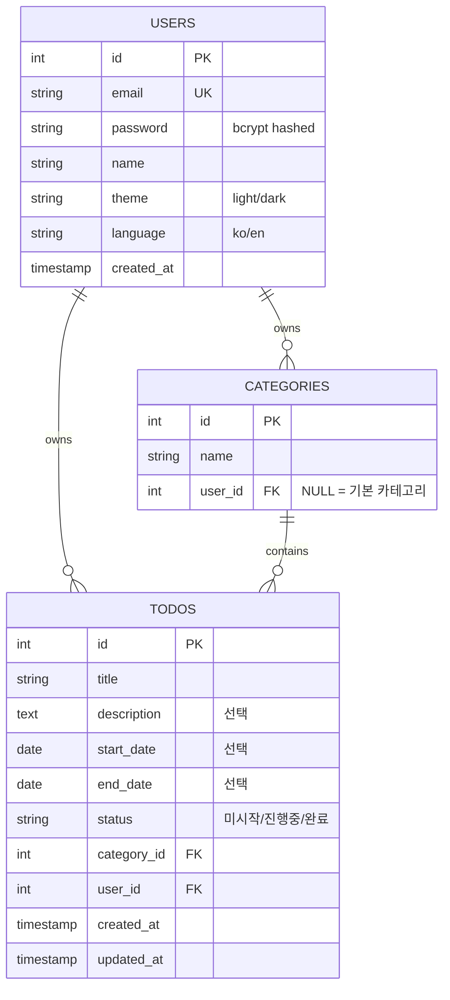
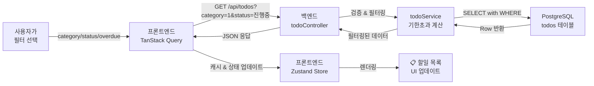
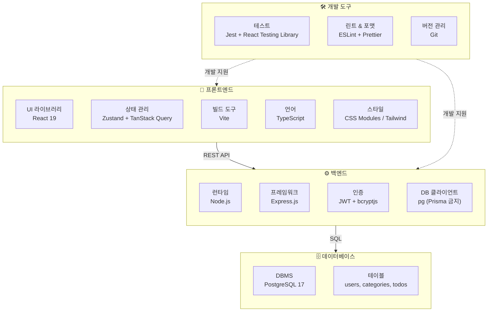
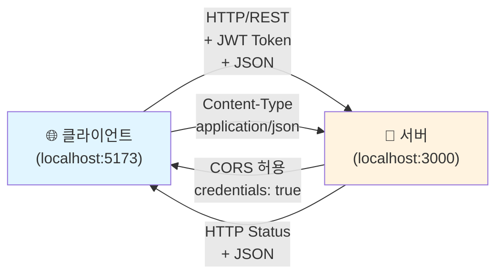

# 기술 아키텍처 다이어그램

**버전:** 1.1  
**작성일:** 2026-05-27  
**작성자:** Naejune Gwon

---

## 변경 이력

| 버전 | 작성일     | 변경자       | 변경 내용                                                                         |
| ---- | ---------- | ------------ | --------------------------------------------------------------------------------- |
| 1.0  | 2026-05-27 | Naejune Gwon | 최초 작성                                                                         |
| 1.1  | 2026-05-27 | Naejune Gwon | 유지보수성 원칙 타입 안정성 표현 명확화 (FE/BE 범위 구분), bcrypt → bcryptjs 통일 |

---

## 1. 시스템 전체 구성도

사용자의 브라우저에서 시작하여 프론트엔드, 백엔드, 데이터베이스까지 전체 시스템의 계층 구조를 나타냅니다.



---

## 2. 백엔드 레이어 구조

Express 프레임워크의 계층별 흐름을 나타냅니다. Routes → Controllers → Services → Database 순서로 데이터가 처리됩니다.



---

## 3. 프론트엔드 레이어 구조

React의 계층별 흐름을 나타냅니다. Pages → Components → Hooks → Zustand/TanStack Query → API Client 순서로 상태와 데이터가 관리됩니다.



---

## 4. 인증 흐름 (JWT 기반)

사용자 로그인부터 인증된 API 요청까지의 전체 흐름을 시간 순서대로 나타냅니다.



---

## 5. 데이터 모델 관계도

users, categories, todos 테이블 간의 관계를 ER 다이어그램 형식으로 나타냅니다.



---

## 6. 주요 기능별 상호작용

할일 조회, 등록, 수정, 삭제 및 필터링 과정에서 프론트엔드와 백엔드 간의 상호작용을 나타냅니다.

### 6.1 할일 목록 조회 (필터 포함)



### 6.2 할일 등록

```mermaid
graph LR
    A["사용자<br/>폼 제출"] -->|title, description| B["프론트엔드<br/>useTodoCreate"]
    B -->|검증| C["POST /api/todos<br/>{ title, categoryId, ... }"]
    C -->|요청| D["백엔드<br/>todoController"]
    D -->|검증 & 권한 확인| E["todoService<br/>createTodo()"]
    E -->|INSERT INTO todos| F["PostgreSQL"]
    F -->|id 반환| E
    E -->|생성된 할일| D
    D -->|{ id, title, ... }| C
    C -->|캐시 무효화 & 상태 갱신| B
    B -->|목록 새로고침| G["📋 할일 목록<br/>새 항목 추가"]
```

---

## 7. 기술 스택 레이어

프론트엔드와 백엔드의 기술 스택을 계층별로 나타냅니다.



---

## 8. 네트워크 통신 구조

프론트엔드와 백엔드 간의 HTTP 통신을 나타냅니다.



---

## 아키텍처 설계 원칙

### 단순성 (Simplicity)

- 필수 기능에 집중하여 불필요한 복잡도 제거
- REST API로 프론트엔드와 백엔드 분리
- 한 가지 책임만 수행하는 계층 설계

### 확장성 (Extensibility)

- 도메인별 폴더 구조로 새 기능 추가 시 기존 코드 수정 최소화
- 공통 라이브러리(lib/)에 재사용 가능한 함수 집중
- 미들웨어 기반의 횡단 관심사 처리

### 유지보수성 (Maintainability)

- 계층 간 명확한 의존성 방향 (하향 의존 원칙)
- 한국어 주석으로 의도와 비즈니스 규칙 명시
- 타입 안정성 (프론트엔드: TypeScript, 백엔드: 입력 검증으로 안전성 확보)

---

**문서 작성 완료**  
이 아키텍처 다이어그램은 TodoList 앱의 전체 구조를 시각적으로 나타내며, 개발자가 각 계층의 역할을 명확히 이해할 수 있도록 설계되었습니다.
