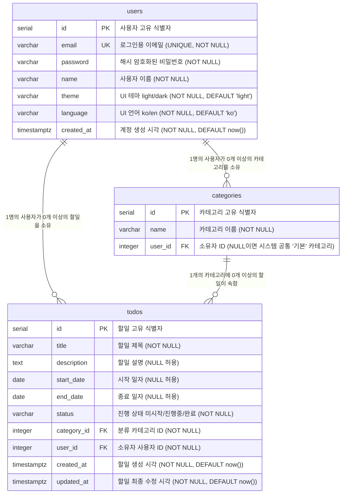

# ERD (Entity-Relationship Diagram)

**버전:** 1.0
**작성일:** 2026-05-27
**작성자:** Naejune Gwon
**참조 문서:** `docs/2-PRD.md` (제품 요구사항 정의서 v2.1)

---

## 변경 이력

| 버전 | 날짜 | 변경자 | 변경 내용 |
|------|------|--------|----------|
| 1.0 | 2026-05-27 | Naejune Gwon | 최초 작성 |

---

## 1. ERD 전체도

TodoList 앱의 3개 핵심 테이블(users, categories, todos)과 테이블 간 관계를 나타낸다.

---

## 2. 테이블 상세 설명

### 2.1 users 테이블

사용자 계정 정보 및 개인 설정(테마, 언어)을 저장하는 테이블이다.

| 컬럼명 | 타입 | 제약사항 | 역할 |
|--------|------|----------|------|
| id | SERIAL | PK, NOT NULL | 사용자 고유 식별자. 자동 증가 정수 |
| email | VARCHAR | UNIQUE, NOT NULL | 로그인에 사용하는 이메일. 중복 불가 |
| password | VARCHAR | NOT NULL | bcrypt 등으로 단방향 해시한 비밀번호. 원문 저장 금지 |
| name | VARCHAR | NOT NULL | 화면에 표시되는 사용자 이름 |
| theme | VARCHAR | NOT NULL, DEFAULT 'light' | UI 테마 설정. 허용값: `light`, `dark` |
| language | VARCHAR | NOT NULL, DEFAULT 'ko' | UI 언어 설정. 허용값: `ko`, `en` |
| created_at | TIMESTAMPTZ | NOT NULL, DEFAULT now() | 계정 생성 시각. 타임존 포함 |

### 2.2 categories 테이블

사용자가 할일을 분류하기 위해 사용하는 카테고리를 저장하는 테이블이다.

| 컬럼명 | 타입 | 제약사항 | 역할 |
|--------|------|----------|------|
| id | SERIAL | PK, NOT NULL | 카테고리 고유 식별자. 자동 증가 정수 |
| name | VARCHAR | NOT NULL | 카테고리 이름. 동일 사용자 내 중복 불가 |
| user_id | INTEGER | FK → users.id, NULL 허용 | 카테고리 소유 사용자. NULL이면 시스템 공통 '기본' 카테고리 |

> 복합 UNIQUE 제약: `(user_id, name)` 조합에 UNIQUE 제약을 적용하여 동일 사용자 내 카테고리 이름 중복을 방지한다.

### 2.3 todos 테이블

사용자의 할일 항목을 저장하는 핵심 테이블이다. 기한초과 여부는 저장하지 않고 조회 시 동적으로 계산한다.

| 컬럼명 | 타입 | 제약사항 | 역할 |
|--------|------|----------|------|
| id | SERIAL | PK, NOT NULL | 할일 고유 식별자. 자동 증가 정수 |
| title | VARCHAR | NOT NULL | 할일 제목. 등록 시 필수 입력값 |
| description | TEXT | NULL 허용 | 할일 상세 설명. 선택 입력값 |
| start_date | DATE | NULL 허용 | 할일 시작 일자. 선택 입력값 |
| end_date | DATE | NULL 허용 | 할일 종료 일자. 선택 입력값. start_date 이후여야 함 |
| status | VARCHAR | NOT NULL | 진행 상태. 허용값: `미시작`, `진행중`, `완료` |
| category_id | INTEGER | FK → categories.id, NOT NULL | 소속 카테고리. 미지정 시 '기본' 카테고리 ID 자동 배정 |
| user_id | INTEGER | FK → users.id, NOT NULL | 할일 소유 사용자 |
| created_at | TIMESTAMPTZ | NOT NULL, DEFAULT now() | 할일 생성 시각. 타임존 포함 |
| updated_at | TIMESTAMPTZ | NOT NULL, DEFAULT now() | 할일 최종 수정 시각. 타임존 포함 |

---

## 3. 관계 설명

테이블 간 외래 키 관계와 참조 무결성 제약사항을 정리한다.

| 관계 | 유형 | 설명 | ON DELETE 동작 |
|------|------|------|----------------|
| users → categories | 1:N | 1명의 사용자가 여러 카테고리를 소유할 수 있다. '기본' 카테고리(user_id = NULL)는 시스템 공통이므로 이 관계에서 제외된다 | CASCADE 또는 RESTRICT (사용자 삭제 시 해당 카테고리 함께 삭제 권장) |
| users → todos | 1:N | 1명의 사용자가 여러 할일을 소유할 수 있다 | CASCADE (사용자 삭제 시 해당 할일 함께 삭제) |
| categories → todos | 1:N | 1개의 카테고리에 여러 할일이 속할 수 있다 | RESTRICT 후 SET DEFAULT — 카테고리 삭제 시 소속 할일의 category_id를 '기본' 카테고리 ID로 변경 (UC-306) |

---

## 4. 비즈니스 규칙 연계

PRD에 정의된 주요 데이터 규칙과 ERD 구조의 대응 관계를 설명한다.

### 4.1 시스템 공통 '기본' 카테고리

- **ERD 반영:** `categories.user_id = NULL`인 레코드가 시스템 공통 '기본' 카테고리이다.
- **규칙 출처:** PRD 8절 categories 테이블 주석, UC-304, UC-306, UC-402
- **동작:** DB 초기 시드(seed)로 사전 생성. 수정 및 삭제 불가. 할일 등록 시 카테고리 미지정이면 자동 배정.

### 4.2 기한초과 Derived 속성 (is_overdue)

- **ERD 반영:** `todos` 테이블에 `is_overdue` 컬럼을 저장하지 않는다.
- **계산 조건:** `end_date < CURRENT_DATE AND status != '완료'`
- **규칙 출처:** PRD 8절 todos 테이블 주석, UC-406
- **동작:** 목록 조회 API에서 서버 기준 날짜(CURRENT_DATE)로 동적 계산 후 응답에 포함. DB 저장값 없음.

### 4.3 사용자 설정 (테마 / 언어) DB 저장

- **ERD 반영:** `users.theme`, `users.language` 컬럼으로 저장.
- **규칙 출처:** UC-203, UC-204, UC-205, 제약사항 10절
- **동작:** 로그인 응답 또는 내 정보 조회 API(`GET /api/users/me`) 응답에 포함되어 클라이언트에 자동 적용.

### 4.4 사용자별 카테고리 이름 중복 방지

- **ERD 반영:** `categories(user_id, name)` 복합 UNIQUE 제약.
- **규칙 출처:** UC-302
- **동작:** 동일 `user_id` 내에서 같은 `name`의 카테고리 생성/수정 시 DB 레벨에서 거부.

### 4.5 종료일자 유효성

- **ERD 반영:** `todos.end_date >= todos.start_date` (애플리케이션 레벨 검증).
- **규칙 출처:** UC-403
- **동작:** DB CHECK 제약 또는 API 서버 비즈니스 로직에서 `end_date < start_date`이면 400 오류 반환.
